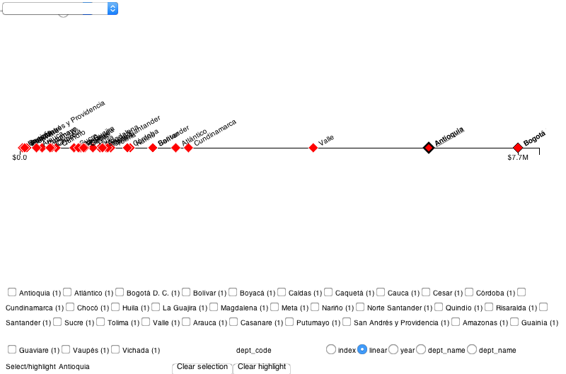
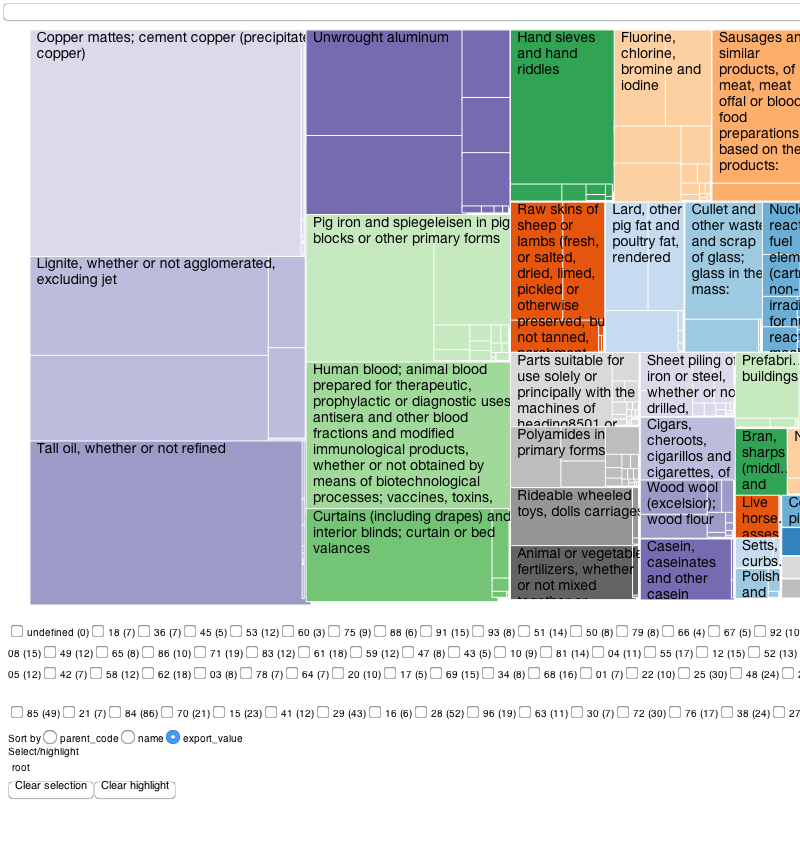
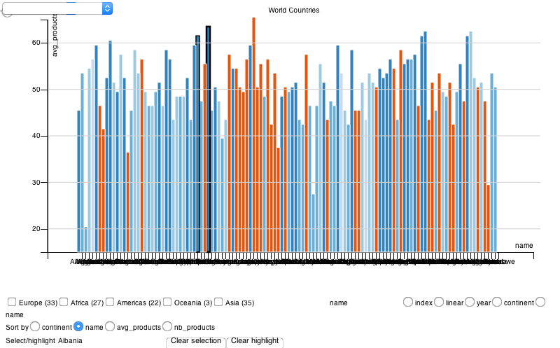
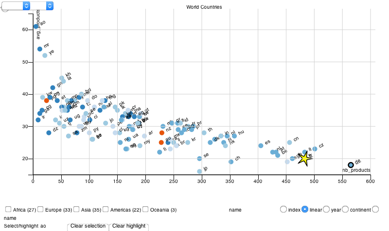
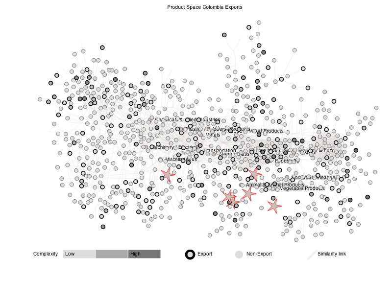
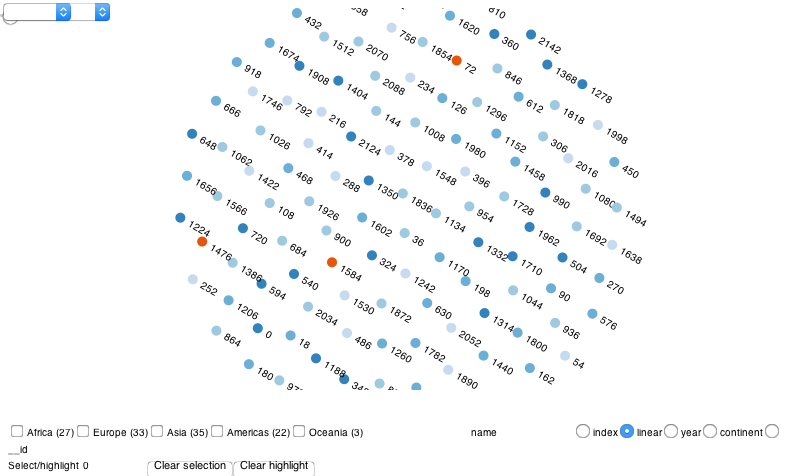

# vis-toolkit

## Usage

Simply add the `vistk` JavaScript and CSS files as below:

```html
<link href="vistk.css" rel="stylesheet">
<script src="vistk.js"></script>
```
## Installation

* Install project dependencies with `npm install`
* Build version `build/vistk.js` with `grunt` and watch changes with `grunt watch`

### Dependencies

* **D3** version `3.4.10` (not tested with other versions, but no reason why not)
* Eventually some `topojson.js`, `queue.js` dependencies for the [geo-map](http://cid-harvard.github.io/vis-toolkit/examples/geomap.html) as well as world shape files 
* Metadata (e.g. [product space] nodes and links) have to be loaded externally

## Examples

### Dot plot 

([Demo](http://cid-harvard.github.io/vis-toolkit/examples/dotplot.html) | [Source](examples/dotplot.html))



* Adding averages
* 

### Sparkline 

([Demo](http://cid-harvard.github.io/vis-toolkit/examples/sparkline.html) | [Source](examples/sparkline.html))


### Treemap 

([Demo](http://cid-harvard.github.io/vis-toolkit/examples/treemap.html) | [Source](examples/treemap.html))



### Bar Chart



### Scatterplot 

([Demo](http://cid-harvard.github.io/vis-toolkit/examples/scatterplot.html) | [Source](examples/scatterplot.html))



### Product Space 

([Demo](http://cid-harvard.github.io/vis-toolkit/examples/scatterplot_productspace.html) | [Source](examples/scatterplot_productspace.html))



Industry Space ([Demo](http://cid-harvard.github.io/vis-toolkit/examples/scatterplot_industryspace.html))

### Line Chart 

([Demo](http://cid-harvard.github.io/vis-toolkit/examples/linechart.html) | [Source](examples/linechart.html))


Work-In-Progress

* Geo Map ([Demo](http://cid-harvard.github.io/vis-toolkit/examples/geomap.html) | [Source](examples/geomap.html))

## HOWTO: Create a Chart

### Boilerplate Code

```html
<div id="viz"></div>
<script>

var  visualization = vistk.viz()
    .params({});

d3.select("#viz").call(visualization);

</script>
```

Where `.params({})` is the configuration of the chart.

## Examples

### Minimal Chart

A [default chart](http://cid-harvard.github.io/vis-toolkit/examples/default_minimal.html) is a minimal representation with no mapping besides showing each row as a dot. For instance, the dataset `[0, 1, 2, 3]` is plotted as a self-organized graph within the SVG canvas boundaries (position doesn't encode anything(. The SVG canvas is attached to a parent DOM element (e.g. `#viz`) as follows:



```html
<div id="viz"></div>
<script>

var  visualization = vistk.viz()
    .params({
      container: "#viz",
      data: [10, 20, 30, 40],
    });

d3.select("#viz").call(visualization);

</script>
```

Each chart in `vistk` has a `type` and for the default chart it is called `none`. 

```jsons
.params({
  container: "#viz",
  data: [{id: 0, value: 10}, {id: 1, value: 20}, {id: 2, value: 30}, {id: 3, value: 40}],
  var_id: 'id',
  var_text: 'value'
});
```

## HOWTO: Chart Customizations

### Items

```js
params.items = [{
  attr: "name",
  marks: [{
    type: "circle",
  },{
    type: "text",
    rotate: "-90"
  }]
}];
```

### Connections

## HOWTO: Interaction

### Attributes

Interaction with the chart (e.g. mouseover, click, ..) automatically updated items attributes

* `__highlighted`
* `__selected`
* `__zoom`

Custom attributes can be created

Custom event dispatches as well

### Data Mapping to Marks
