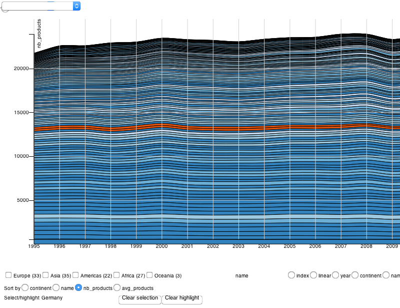

# Reference

- [Reference](#reference)
  - [General](#general)
    - [`type`](#type)
    - [`margin`](#margin)
    - [`container`](#container)
    - [`title`](#title)
    - [`var_color`](#var_color)
    - [`color`](#color)
    - [`var_text`](#var_text)
  - [Data](#data)
    - [`data`](#data)
    - [`var_id`](#var_id)
    - [`var_group`](#var_group)
    - [`set`](#set)
    - [`aggregated`](#aggregated)
    - [`selection`](#selection)
    - [`highlight`](#highlight)
  - [Axis / Layout Mapping](#axis--layout-mapping)
  - [Items](#items)
    - [`items`](#items)
    - [`items.marks`](#itemsmarks)
    - [`items.marks.type`](#itemsmarkstype)
    - [`items.marks.var_type`](#itemsmarksvar_type)
    - [`items.marks.title`](#itemsmarkstitle)
    - [`items.marks.class`](#itemsmarksclass)
    - [`items.marks.fill`](#itemsmarksfill)
    - [`items.marks.enter`](#itemsmarksenter)
    - [`items.marks.exit`](#itemsmarksexit)
    - [`items.marks.translate`](#itemsmarkstranslate)
    - [`items.marks.rotate`](#itemsmarksrotate)
  - [Connect](#connect)
    - [`connect`](#connect)
  - [Time](#time)
    - [`time`](#time)
    - [`time.var_time`](#timevar_time)
    - [`time.current_time`](#timecurrent_time)
    - [`time.parse`](#timeparse)
  - [UI](#ui)
    - [`ui`](#ui)
  - [Misc](#misc)
    - [`lang`](#lang)
  - [Utils (Public)](#utils-public)
    - [`vistk.utils.min`](#vistkutilsmin)
    - [`vistk.utils.max`](#vistkutilsmax)
    - [`vistk.utils.translate_along`](#vistkutilstranslate_along)
  - [Utils (Private)](#utils-private)
    - [`utils.draw_mark`](#utilsdraw_mark)
    - [`utils.draw_chart`](#utilsdraw_chart)

> This document lists all the parameters to create and customize visualizations.

* **Default:** Default values related to charts are located in <a href='src/vars.js'>src/vars.js</a>. Defaults parameters for graphical marks are in <a href='src/utils.js'>src/utils.js</a>.

* **Example:** Most examples are issued from the examples located in <a href='src/visualizations/'>src/visualizations/</a>.

Most of the parameters are of type:
* `String` 
* `Object`
* `function`

## General

The following set of parameters that impact a whole chart, and will propagate to all the marks being drawn.

### `type`

> Type of template being used for the visualization.

* **Type:** `String`

* **Default:** `none`, which is a self-organized layout (see [/examples/default_minimal.html](/examples/default_minimal.html) with no position encoding and marks are circles.)
&nbsp;
This is by far the most important parameter as it will automatically pre-generate a set of parameters (marks, layout, etc.)

* **Example:** `barchart`, `sparkline`, `dotplot`, `barchart`, `linechart`, `scatterplot`, etc.

* **Note:** The full list of templates is available in <a href='src/visualizations/'>src/visualizations/</a>. To create your own template just add it in this folder and refer to it in the `Gruntfile.js`.
&nbsp;
A template file usually describes the graphical marks to be used as well as the pre-processing to be done before drawing those.

* **Important:** All further parameter will override the original template.

### `margin`

> Defines the margins for the chart within the SVG.

* **Type:** `Object`

* **Default:** `{}` or no margin e.g. `{top: 0, right: 0, bottom: 0, left: 0}`

* **Example:** `{top: 10, right: 10, bottom: 30, left: 30}`

* **Note:** Follows the [D3 margin convention](http://bl.ocks.org/mbostock/3019563) for the sake of consistency with D3 examples.

### `container`

> The selector for the DOM element being used to append the visualization to.

* **Type:** `String`

* **Default:** `#viz`

* **Example:** `#viz_barchart`

* **Note:** ..

### `title`

> The title to use for the visualization (in case it features a space for the title)

* **Type:** `String`

* **Default:** &empty;

* **Example:** "This is a bar chart"

* **Note:** Some chart templates feature a title, some others don't.

### `var_color`

> Adds color to the chart using the specified attribute

* **Type:** `String`

* **Example:** Continent grouping countries with the same color ([line chart](http://cid-harvard.github.io/vis-toolkit/examples/linechart.html)).

A custom function can be passed  `var_color: 'rank'` and `color: d3.scale.linear().domain([0, 123]).range(['red', 'blue'])`.

* **Note:** Using the **color** parameter as color scale.

### `color`

> Color scale function used when drawing marks

* **Type:** `Function`

* **Default:** `d3.scale.category20c()`.

* **Example:** Custom color scales can be created such as `d3.scale.ordinal().domain(["Africa", "Americas", "Asia", "Europe", "Oceania"]).range(["#99237d", "#c72439", "#6bc145", "#88c7ed", "#dd9f98"])`

### `var_text`

> Sets the variable to draw text

* Type:** `String`

* **Default:** &empty;

* **Example:** `name`

* **Note:** Not all graphical marks contain text to be displayed. Naturally the `text` one requires one.

If no id has been set, then `var_text` defaults to `__id`.

### `z_index`

* Type:** `Array`

* **Default:** `[{selector: '.connect__group', attribute: '__highlighted', type: 'productspace', weight: 1}, {selector: '.mark__group', attribute: '__aggregated', type: 'productspace', weight: 1}]`

* **Example:** `name`

* **Note:** Not all graphical marks contain text to be displayed. Naturally the `text` one requires one.

### `translate`

* Type:** `Array`

* **Default:** `[0, 0]`

* **Example:**

* **Note:** Used by the zoom to focus on a specific region that is the bounding box of some nodes, along with the `scale` of the `transfom`.
*&nbsp;
The translate operates directly on the child node of the root `<svg>` node.

### `rotate`

* Type:** int

* **Default:** `0`

* **Example:**

* **Note:** Same as for `translate` above.


## Data

All parameters related to the semantic of the dataset.

### `data`

> The dataset to be used across all the visualizations.
&nbsp;
We consider a dataset made `items`, which are unique objects being drawn. Sometimes each row of a dataset refers to those objects with a unique `id`. By default, if no `id` exist, it will automatically create one using the index of each raw and set the `var_id` parameter to the `__id` attribute. 

* **Type:** `Array`

* **Default:** []

* **Example:** `[0, 1, 2, 3]` is a dataset with no id, contrary to `[{id: 0, value: 10}, {id: 1, value: 20}, {id: 2, value: 30}, {id: 3, value: 40}]` and in this cans the is defined using **var_id**.

* **Note:** If no id in the dataset, then it considers each rows as an item and creates a `var__id` attribute which value is the index of the row. Thus, the previous dataset `[0, 1, 2, 3]` can be used, and **var_id** will implicitly be set to `__id`.

### `var_id`

> The attribute being used to identify each item in the dataset.

* **Type:** `String`

* **Default:** `__id`

* **Example:** 

Note: The `__id` is automatically created in case no `var_id` is set.

### `var_group`

> The variable to be used to create groups of items

* **Type:** `String`

* **Default:**  &empty;

* **Note:** Right now, only one level of hierarchy is provided.

* **Example:** Countries can be grouped by *continent*

### `set`

> Creates custom attributes for the dataset.

* **Type:** `String`, `Boolean`

* **Default:**  &empty;

* **Example:** `.set('aggregated', true)` creates aggregates data with a `__aggregated` set to true. Then, it is possible to draw graphical marks specifically for those data:

```js
{
  var_mark: '__aggregated',
  type: d3.scale.ordinal().domain([true, false]).range(["tick", "none"]),
}
```

* **Note:** New data are appended to the current dataset, with a `__aggregated` attribute set to `true`.

### `aggregated`

`aggregated` data are appended to the original dataset with a `__aggregated` attribute set to true. This means those two datasets will co-habit together.

* **Type:** `Array`

### `selection`

> Selected items, which differ from the highlight as tt is more persitent

* **Type:** `Array`

* **Example:**

* **Default:** []

### `highlight`

> Highlights items

* **Type:** `Array`

* **Example:** If using the countries dataset `["France", "Germany"]`

Highligthing can condition the display of a mark or not. In the example below, it displays a text item mark when the mouse hovers an existing mark:

```js
marks: [{
  var_mark: '__highlighted',
  type: d3.scale.ordinal().domain([true, false]).range(["text", "none"]),
  rotate: "0"
}
```

Further conditions can be set on the mark for example to update its `text-anchor` property based on the current position of the mark:

```js
 marks: [{
  var_mark: '__highlighted',
  type: d3.scale.ordinal().domain([true, false]).range(["text", "none"]),
  rotate: "0",
  translate: [0, -15],
  text_anchor: function(d) {
    var parentGroup = d3.select(this.parentNode);
    var parentSVG = d3.select(this.parentNode.parentNode.parentNode);
    var parentX = d3.transform(parentGroup.attr("transform")).translate[0];
    var svgWidth = +parentSVG.attr("width");
    if(parentX < svgWidth/3) {
      return "start";
    } else if(parentX > 2 * svgWidth/3) {
      return "end";
    } else {
      return "middle";
    }
  }
}
```
* **Default:** `[]`

* **Note:** Values are defined according to the `var_id` parameter
&nbsp;
The `productspace` chart type also generates highlights for its metadata: the links are hilighted with `__highlighted` attribute and the adjacent nodes to the currently highlighed one are have a `highlighted__adjacent` flag on.

## Axis / Layout Mapping

Below are several variables aimed at customizing the chart's template. Those are only given for the `x` axis, but also works for the `y` axis.

* `var_x` (String) The data attribute being used for most of the scale mappings.
* `x_scale`
* `x_type` (Default: linear)
* `x_scale` (Default: [])
* `x_ticks` (Integer) Number of ticks (Default: 5). Note: if set to 2, the first and last tick labels anchor are respectively set to start and end.
* `x_axis` (Default: null)
* `x_format` function(d) { return d; },
* `x_tickSize` (Default: 10)
* `x_tickPadding` (Default: 0)
* `x_tickValues` (Default: null)
* `x_axis_show` (Default: false)
* `x_axis_orient` (Default: "bottom")
* `x_grid_show` (Default: false)
* `x_text` (Boolean) Displays the text on the axis (Default: true). 
* `x_axis_translate` (Default: [0, 0])
* `x_invert` (Default: false)

## Items

The main way to represent data is to use **items**, which are the direct representation of data. Another type of representation is **connect** which are derived from items.

### `items`

> Draws a graphical mark on the screen and defines some of its properties.

* **Type:** `Array`

* **Default:** `[]`

* **Example:**

* **Note:** Each item creates a `<SVG>` group of marks of class `.mark__group`. This group handles the position of the marks with a `transform` attribute.
&nbsp;


### `items.marks`

> Creates a new `<SVG>`  group that will contain marks.

* **Type:** `Array`

* **Default:** `{}` no mark is being drawing (unless specified by the type).

* **Example:**

* **Note:** Each mark being drawn has three arguments:

* Data for the item
* Index among all data
* Vars for all the variables and 


### `items.marks.type`

> The type of the graphical mark.

* **Type:**

* **Default:**

* **Example:**

* **Note:** Can be a function

### `items.marks.var_type`

> Variable to customize the type of mark to be used.

* **Type:**

* **Default:**

* **Example:**

* **Note:**

### `items.marks.title`

> Appends a SVG title element and sets its value.

* **Default:** &empty;

* **Example:** 

```js
marks: [{
  type: "circle",
  rotate: "0",
  var_color: 'category',
  var_r: "size",
  title: function(d) { return d['pname']; }
}
```

* [examples/scatterplot_industryspace.html](http://cid-harvard.github.io/vis-toolkit/examples/scatterplot_industryspace.html)

* **Note:**

### `items.marks.class`

> To create custom classes for the marks.

* **Type:**

* **Default:**

* **Example:**

* **Note:**

### `items.marks.fill`

> Fills the mark with the desired color.

* **Type:** `String` | `function`

* **Default:** &empty;

* **Example:** `#fff`, `function() { return '#000'; }`

* **Note:** Works with `circle` marks, not for all other marks.

### `items.marks.enter`

> Customizing the enter function for marks.

* **Type:**

* **Default:** Nothing.

* **Example:**

* **Note:**

### `items.marks.exit`

> Customizing the exit function for marks.

* **Type:**

* **Default:** Nothing.

* **Example:**

* **Note:**

### `items.marks.translate`

> Translate mark

* **Type:** `Array`

* **Default:** [20, 20]

* **Example:** 

* **Note:** We need a minimal offset between the tooltip and the mark.

### `items.marks.rotate`

> Rotate mark.

* **Type:** `Array`

* **Default:** 0

* **Example:** 

* **Note:** Rotation is in degrees, clockwise.

## Connect

The second type of marks that are derived from **items**.

### `items.marks.evt`

> Rotate mark.

* **Type:** `Array`

* **Default:** 0

* **Example:** 

* **Note:** Rotation is in degrees, clockwise.

## Connect

The second type of marks that are derived from **items**.


### `connect`

> Second type of graphical mark that aims at connecting items.

* **Type:** `Object`

* **Default:** `{}` no connect mark is being drawing (unless specified by the * **pe).

* **Example:**

* **Note:**

[The rest is quite similar to the **items** but still need to be filled out]

## Time

### `time`

> Informs that the dataset is temporal.

* **Type:** `Object`

```html
time: {
  var_time: 'year', 
  current_time: 2012,
  parse: function(d) { return d; }
}
```

### `time.var_time`

> The variable that sets time.

* **Type:** `String`

* **Default:** &empty:

* **Example:** `year`

* **Note:** ..

### `time.current_time`

* **Default:**

* **Example:**

* **Note:** The `current_time` can defined to a specific value, or be set using `vistk.utils.min` which is a public function to retrieve

Some time-related values are internally created:

* `time.points`: all the time points found in the dataset
* `time.interval` the min and the max of time points

### `time.parse`

> Parses the time values from the dataset.

* **Type:** `Function`

* **Default:** `function(d) { return d; }`

* **Example**: Depends on the way time values are formated in the dataset.

`"2008"` &rarr; `d3.time.format("%Y")`&nbsp;
`"Apr 2000"` &rarr; `d3.time.format("%b %d, %Y")`&nbsp;

* **Note:** See the [D3 time formatting](https://github.com/mbostock/d3/wiki/Time-Formatting) documentation.

## UI

### `ui`

> Specify which UI element to be created.

* **Type:** `Object`

* **Example:**

```js
{
  default: true,
  options: ["country", "continent", "year"],
  sort: ['continent', "name", 'avg_products', 'nb_products']
}
```


## Chart Specifics

* `padding` for treemaps


## Misc

### `lang`

> Changes the current language of the UI.

* **Type:** `String`

* **Default:** `en_US`

* **Example:** `es_ES`, `fr_FR`

* **Note:** Translations are currently built-in, should be made available separately.

## Utils (Public)

A list of public functions made available mostly to be used by the parameters.

### `vistk.utils.min`

> Returns the min value

* **Type:** `Function`

* **Default:**

* **Example:**

* **Note:** ..


### `vistk.utils.max`

> Returns the max value

* **Type:** `Function`

* **Default:**

* **Example:**

* **Note:** ..


### `vistk.utils.translate_along`

> Transition between item and connect marks

* **Type:** `Function`

* **Default:**

* **Example:**

* **Note:** The function allows

## Utils (Private)

### `utils.draw_mark`

> Draws a mark

* **Type:** `Function`

* **Default:** `circle`

* **Example:** `rect`, `tick`, `star`, ..

* **Note:**


### `utils.draw_chart`

> Draws a chart

* **Type:** `Function`

* **Default:** `none`

* **Example:** `barchart`, `linechart`, ..

* **Note:** ..

## Templates

### Dot plot 

([Demo](http://cid-harvard.github.io/vis-toolkit/examples/dotplot.html) | [Source](examples/dotplot.html))


### Sparkline 

([Demo](http://cid-harvard.github.io/vis-toolkit/examples/sparkline.html) | [Source](examples/sparkline.html))


### Treemap 

([Demo](http://cid-harvard.github.io/vis-toolkit/examples/treemap.html) | [Source](examples/treemap.html))


### Bar Chart


### Scatterplot 

([Demo](http://cid-harvard.github.io/vis-toolkit/examples/scatterplot.html) | [Source](examples/scatterplot.html))


### Product Space 

([Demo](http://cid-harvard.github.io/vis-toolkit/examples/scatterplot_productspace.html) | [Source](examples/scatterplot_productspace.html))


Industry Space ([Demo](http://cid-harvard.github.io/vis-toolkit/examples/scatterplot_industryspace.html))

### Line Chart

([Demo](http://cid-harvard.github.io/vis-toolkit/examples/linechart.html) | [Source](examples/linechart.html))


### Stacked Graph

([Demo](http://cid-harvard.github.io/vis-toolkit/examples/stacked.html) | [Source](examples/stacked.html))



Work-In-Progress

* Geo Map ([Demo](http://cid-harvard.github.io/vis-toolkit/examples/geomap.html) | [Source](examples/geomap.html))


## Examples

### Minimal Chart

A [default chart](http://cid-harvard.github.io/vis-toolkit/examples/default_minimal.html) is a minimal representation with no mapping besides showing each row as a dot. For instance, the dataset `[0, 1, 2, 3]` is plotted as a self-organized graph within the SVG canvas boundaries (position doesn't encode anything(. The SVG canvas is attached to a parent DOM element (e.g. `#viz`) as follows:


```html
<div id="viz"></div>
<script>

var  visualization = vistk.viz()
    .params({
      container: "#viz",
      data: [10, 20, 30, 40],
    });

d3.select("#viz").call(visualization);

</script>
```

Each chart in `vistk` has a `type` and for the default chart it is called `none`. 

```js
.params({
  container: "#viz",
  data: [{id: 0, value: 10}, {id: 1, value: 20}, {id: 2, value: 30}, {id: 3, value: 40}],
  var_id: 'id',
  var_text: 'value'
});
```

## HOWTO: Chart Customizations

### Items

```js
params.items = [{
  attr: "name",
  marks: [{
    type: "circle",
  },{
    type: "text",
    rotate: "-90"
  }]
}];
```

